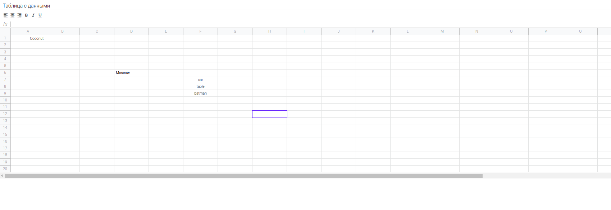

# Excel
**Excel(pet project)** – Аналог всем известного Microsoft Excel выполненный на чистом на JavaScript

## Getting Started
```sh
$ npm install
$ npm start
```

### MVP 
  + Создание новой таблицы
  + Сохранение и вывод всех таблиц
  + Заполнение и ресайз Excel таблицы

  
 
### Используемые технологии:


* JavaScript(ES2016)
* Webpack
* eslint-config-google
* HTML 5/ CSS 3 (SCSS)


### Как это выглядит:
  
  ____
  
  ____

  
